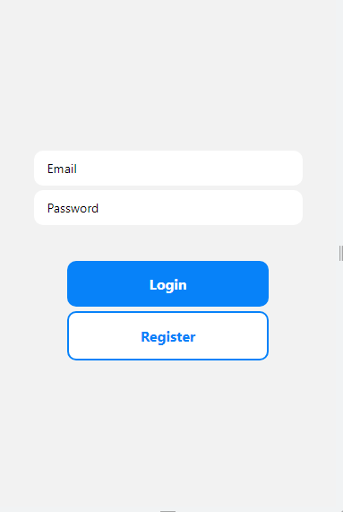

# auth-app
auth-app is a todo auhtentication application coded in React Native and firebase Authentication

Users can use this application to perform the following:-

* Signup
* Login
* Logout

The application can be used in other bigger apps that needs an authentication system.

## Screenshots
 

## How to install and run this project
1. clone the repo
2. run `npm install expo-cli`
3. run `expo start` to start the development server